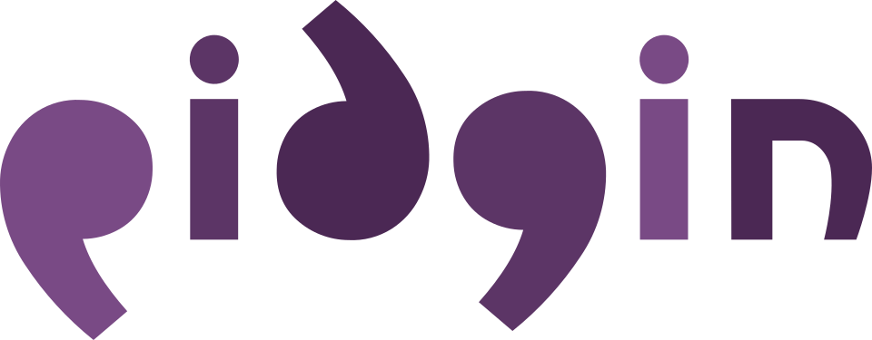

# Pidgin: The Universal Chat Client

Pidgin is a chat client that allows you to chat on multiple networks at once from
the same client which runs on FreeBSD, Linux, macOS, and Windows.

For more information about the project, refer to the following:

 * The **[Project Website](https://pidgin.im/)**
 * The **[Source Code Repository](https://keep.imfreedom.org/pidgin/pidgin/)**
 * The **[Issue Tracker](https://issues.imfreedom.org/issues/PIDGIN?u=1)**

We also maintain a list of known third party plugins at
[pidgin.im/plugins](https://pidgin.im/plugins/).

## Contributing

Pidgin is developed using **[mercurial](https://www.mercurial-scm.org/)** and
thus not here on GitHub. For more information, check out our
[contributing documentation](https://pidgin.im/development/contributing/).

